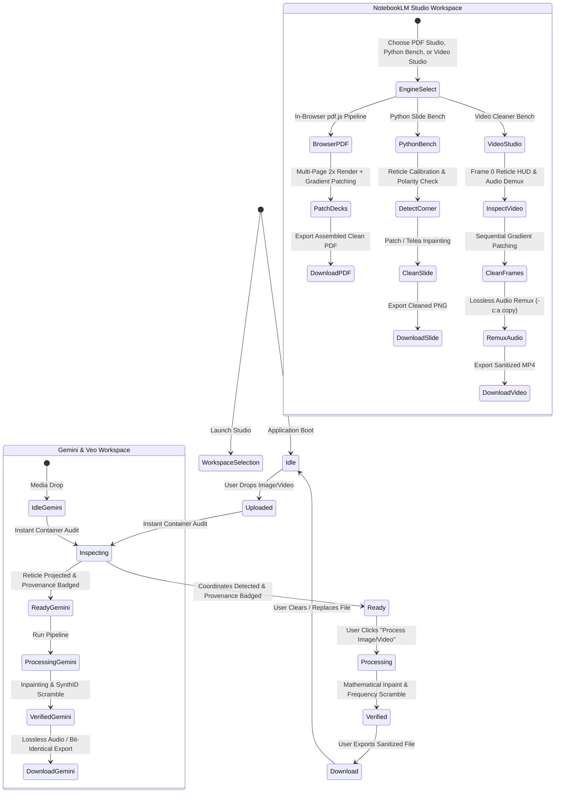

# Semantic Design System · Watermark Studio

## 1. System Identity & Mission

**Watermark Studio** is a high-craft, local-first media laboratory designed for forensic watermark eradication, DeepMind SynthID frequency disruption, C2PA Content Credentials provenance stripping, and NotebookLM presentation slide logo cleaning from Google Gemini images, Google Veo videos, and multi-page PDF presentation decks.

The interface rejects default SaaS component libraries and template layouts in favor of an **Industrial Darkroom Workbench** aesthetic — purposeful, air-gapped, high-contrast, and dense with technical feedback.

---

## 2. Atmosphere & Mood

* **Vibe:** *Industrial Darkroom Workbench & Precision Laboratory*
* **Key Adjectives:** Utilitarian, tactile, hyper-focused, air-gapped, calibrated, high-contrast.
* **Aesthetic Thesis:** The UI behaves like an optical inspection station. Low ambient light reduces eye strain during pixel evaluation, while laser-precise Cyber-Red and Electric Cyan accents highlight detected watermark coordinates, container provenance, and telemetry readouts.

---

## 3. Semantic Color Palette

| Token Name | Natural Language Description | Hex Code | RGB / Alpha | Functional Role |
| :--- | :--- | :--- | :--- | :--- |
| `--surface-canvas` | Deep Obsidian Void | `#060608` | `rgb(6, 6, 8)` | Base backdrop with top-down radial vignette |
| `--surface` | Matte Darkroom Carbon | `#0B0B0D` | `rgb(11, 11, 13)` | Primary application workspace floor |
| `--surface-card` | Low-Reflectance Graphite | `#141418` | `rgb(20, 20, 24)` | Workbench panels, dropzone, telemetry pods |
| `--surface-high` | Elevated Charcoal | `#1A1A22` | `rgb(26, 26, 34)` | Active tabs, popovers, and elevated controls |
| `--surface-highest`| Highlight Carbon | `#1E1E26` | `rgb(30, 30, 38)` | Focus containers and hovered cards |
| `--border` | Technical Wire Rule | `#262633` | `rgb(38, 38, 51)` | Structural 1px division rules |
| `--border-hover` | Illuminated Wire Rule | `#353545` | `rgb(53, 53, 69)` | Interactive hover state for cards & pods |
| `--primary` | Laser Cyber-Red | `#F2482C` | `rgb(242, 72, 44)` | Primary execution triggers and watermark reticles |
| `--primary-hover` | Thermal Flame Red | `#FF7452` | `rgb(255, 116, 82)` | Primary button hover state |
| `--primary-glow` | Laser Bloom | — | `rgba(242, 72, 44, 0.45)` | Glow aura on active processing triggers |
| `--cyan` | Electric Cyan Telemetry | `#2FD3E1` | `rgb(47, 211, 225)` | Clean output badges, presets, and active signals |
| `--cyan-dim` | Cyan Phosphor Mist | — | `rgba(47, 211, 225, 0.12)` | Subtle container tints for verified states |
| `--cyan-border` | Cyan Reticle Wire | — | `rgba(47, 211, 225, 0.35)` | Outline for detected watermark coordinates |
| `--amber` | Calibrated Signal Amber | `#E8A33D` | `rgb(232, 163, 61)` | Warning tags, parameter values, slider thumbs |
| `--amber-dim` | Amber Warning Wash | — | `rgba(232, 163, 61, 0.12)` | AI prompt detection and notice badges |
| `--emerald` | Sanitized Green | `#22C55E` | `rgb(34, 197, 94)` | Clean container confirmations (0 findings) |
| `--crimson` | Critical Alert Red | `#FF4D4D` | `rgb(255, 77, 77)` | C2PA Content Credentials detected badge |
| `--purple` | NotebookLM Indigo | `#9333EA` | `rgb(147, 51, 234)` | NotebookLM workspace mode badges |
| `--text-display` | Pure Optical White | `#FFFFFF` | `rgb(255, 255, 255)` | Headlines, display titles, and prominent numbers |
| `--text-main` | High-Contrast Platinum | `#E4E1E7` | `rgb(228, 225, 231)` | Core interface body text |
| `--text-muted` | Technical Gray | `#9B9BAA` | `rgb(155, 155, 170)` | Secondary labels, descriptions, and metadata |

---

## 4. Typography Hierarchy

```text
Display / Headlines  ──> Sora (Weights: 700, 800 | Letter-spacing: -0.035em)
Interface / Body     ──> Hanken Grotesk (Weights: 400, 500, 600 | Sans-serif)
Telemetry / Code     ──> JetBrains Mono (Weights: 500, 700 | Monospace precision)
```

* **Display H1 (`.main-title`):** `Sora`, 800 weight, `clamp(2.3rem, 4.8vw, 3.6rem)`, tight line height `1.02`. Uncompromising presence that grounds the application.
* **Section Kickers (`.section-title-tag`):** `JetBrains Mono`, 700 weight, `0.72rem`, uppercase, `letter-spacing: 0.14em`, Electric Cyan color. Emulates hardware oscilloscope headers.
* **Body Text (`p`, `.main-lede`):** `Hanken Grotesk`, 400/500 weight, `0.98rem`, line height `1.6`, muted platinum color for reading comfort.
* **Metrics & Telemetry (`.telemetry-pod-val-*`):** `JetBrains Mono`, 700 weight, `1.15rem`, tabular numbers with soft neon text shadows.

---

## 5. Geometry, Radii & Shape Language

* **Pill Badges (`rounded-full`, 9999px):** Applied to telemetry status pills, online indicator dots, and container audit chips. Communicates dynamic live state.
* **Panel Radius (8px):** Structural cards, the central dropzone, and inspection frames use an 8px radius — tight, modern, and disciplined.
* **Control Radius (5px):** Input sliders, radios, and button controls use a compact 5px radius to maintain physical switch tactile feedback.
* **Technical Dividers (1px Rules):** Hard, single-pixel hairline dividers (`#262633`) partition the workspace into logical functional phases without cluttering the screen with card nesting.

---

## 6. Depth & Layer Elevation

* **Base Layer (Elevation 0):** Deep radial gradient simulating top-down workbench spotlighting:
  ```css
  background: radial-gradient(circle at 50% -10%, #171720 0%, #0B0B0D 60%, #060608 100%);
  ```
* **Card Panels (Elevation 1):** Solid `#141418` fill with 1px `#262633` border. Does not rely on heavy drop shadows; depth is achieved through luminance contrast against the carbon floor.
* **Interactive Focus (Elevation 2):** On hover or selection, borders illuminate to `#353545` or `var(--cyan-border)` accompanied by whisper-soft phosphor diffuse glow:
  ```css
  box-shadow: 0 0 16px rgba(47, 211, 225, 0.12);
  ```
* **Active Overlay (Elevation 3):** Reticles, zoom crop viewports, and difference heatmaps project over media with high-contrast outlines and colored corner markers.

---

## 7. Component Architecture & Patterns

### 7.1 Sidebar Control Rail
* **Brand Header:** Uppercase `WATERMARK STUDIO` headline alongside an active `AIR-GAPPED` pulse pill.
* **Workspace Selector:** Global switcher routing the central canvas between:
  1. `✦ Gemini & Veo (Images & Video)`: Eradicate canonical 4-pointed stars, Veo text marks, disrupt SynthID, and strip C2PA manifests.
  2. `📑 NotebookLM Studio (PDFs, Slides & Video)`: Clean multi-page presentation decks, slide images, and video recordings with mathematical gradient patches and lossless audio preservation.
* **Gemini/Veo Controls:** Method selector (Inpaint, Reconstruct, Inverse Alpha), Gain slider (amber thumb), Bounding Box Scale, and SynthID / Provenance Tier selector (`Off`, `Safe`, `Paranoid`, `Nuclear`).
* **NotebookLM Controls:** Engine switcher between `Client-Side PDF Studio (Browser)`, `Python Slide Bench (High-Precision Image Mode)`, and `Video Cleaner Studio (Lossless Audio Passthrough)`.

### 7.2 Section 01: Source Media Dropzone
* **Drop Target:** Dashed border container with format chips (`PNG`, `JPG`, `WEBP`, `MP4`, `MOV`, `WEBM`).
* **Enforced Guardrails:** Single-file isolation (prevents accidental batch memory spikes), 100MB maximum payload limit.

### 7.3 Section 02: Processing Profile Telemetry
* **5-Pod Telemetry Grid:** Real-time synchronized readout of current engine configuration:
  1. `GAIN` (Amber numeric readout)
  2. `SCALE` (Amber multiplier readout)
  3. `MODE` (Cyan algorithm tag: `INPAINT`, `RECON`, `MATH`)
  4. `PRESET` (Cyan catalog indicator)
  5. `SYNTHID` (Amber/Cyan sanitization tier: `NONE`, `SAFE`, `PARANOID`, `NUCLEAR`)

### 7.4 Section 03: Source Preview & Provenance Audit
* **Single-View Guarantee:** When side-by-side results are rendered, the unedited source is automatically omitted from Step 03 to guarantee the source image is never displayed twice.
* **Provenance Chip Bar:** Live status pills showing:
  * `🔴 C2PA MANIFEST DETECTED`
  * `🟠 AI PROMPT EMBEDDED`
  * `🔵 EXIF / METADATA`
  * `📍 GPS LOCATION`
  * `🟢 CLEAN CONTAINER`
* **Container Fingerprint Inspector:** Collapsible accordion showing exact detected metadata keys, raw prompt text snippets, and severity ratings.

### 7.5 Section 04: Inspection Bench & Results
* **Tri-Mode Viewport:**
  1. **Side-by-Side (Full Frame):** Dual-column synchronized comparison with clean header badges.
  2. **100% Zoom Crop (Watermark Region):** Pixel-for-pixel 48px padded inspection of the repaired zone.
  3. **Difference Heatmap (Delta Pixels):** Absolute mathematical subtraction ($|Orig - Clean| \times 4$) proving zero smudging outside the logo boundary.

### 7.6 Section 05: Technical Guide, Specifications & FAQ
* **How It Works Grid:** 6 technical overview cards explaining Keyframe Consensus, Bi-Harmonic Row Reconstruction, Lossless Audio Passthrough, Air-Gapped Privacy, SynthID Disruption, and C2PA Stripping.
* **Preset Matrix Table:** High-density monospace specification table outlining asset formats, detection strategies, and audio integrity.
* **FAQ Accordion:** Expandable questions providing immediate, authoritative answers matching schema.org structured data.

### 7.7 Section 06: NotebookLM Studio Sub-App (PDFs, Slides & Video)
* **Workspace Isolation:** Clean separation via the sidebar workspace router so users can focus entirely on presentation decks, slide images, and full video recordings.
* **Client-Side PDF Studio (`notebooklm_embedded.html`):**
  * **Zero-Upload Guarantee:** Executes entirely in client browser memory using `pdf.js` for rendering and `jspdf` for document compilation.
  * **Multi-Page Deck Support:** Iterates through every page of uploaded PDF presentations at 2x crisp scale.
  * **Mathematical Boundary Patching:** Samples background pixels immediately above the logo watermark ($srcY = y - wmH$) with a 12px progressive feathering gradient to guarantee zero blur smudging, preserving sharp slide border rules and presentation cards.
  * **Darkroom UI Integration:** Live progress bar, visual status telemetry, and one-click PDF download styled in the Darkroom Workbench aesthetic.
* **Python Slide Bench (High-Precision Image Mode):**
  * **Targeting Reticle:** Neon cyan HUD box (`draw_notebooklm_reticle`) showing exact calculated watermark coordinates on uploaded slide images.
  * **Tri-Mode Forensic View:** Side-by-side full slide comparison, 100% corner zoom crop, and difference delta heatmap proving zero alterations outside the logo rectangle.
  * **Algorithmic Selection:** Toggle between `Gradient Patch` (fast, crisp gradient preservation) and `OpenCV Telea Inpaint` (handles textured cards and photos).
  * **Dynamic Polarity Detection:** Automatically classifies background as light vs. dark to optimize patch contrast and boundary matching.
* **Video Cleaner Studio (Lossless Audio Passthrough):**
  * **High-Speed Frame Processing:** Sequential frame cleaning using optimized NumPy vertical gradient cloning with 10px boundary feathering.
  * **Bit-Identical Audio Preservation:** Demuxes original audio stream and remuxes with `-c:a copy` via FFmpeg, guaranteeing 100% lossless audio preservation with zero drift or re-encoding artifacts.
  * **Aspect Ratio Awareness:** Supports both 16:9 landscape slides and 9:16 portrait mobile/vertical videos (such as NotebookLM video walkthroughs).
  * **Integrated Sample Loader:** Instant 1-click loading of demo video (`How_to_Scale_PSI_for_Data_Drift.mp4`) with live frame 0 reticle preview.

---

## 8. Interaction State Machine



1. **Upload & Parse:** Media is read into isolated temporary memory.
2. **Container Audit:** `fingerprint_cleaner` parses byte chunks, surfacing C2PA, prompts, and EXIF flags in real time.
3. **Template Match:** Discrete catalogs resolve canonical logo coordinates with sub-pixel cross-correlation.
4. **Local Execution:** OpenCV Inpainting + Dilation eliminates the mark without cloud latency.
5. **Disruption & Sanitization:** If Nuclear/Safe mode is engaged, C2PA chunks are purged or Lanczos frequency scrambling is applied.
6. **Export Delivery:** File is downloaded directly with lossless audio remuxing (video) or bit-identical container stripping (images).

---

## 9. Responsive Breakpoints

* **Wide Desktop (> 1200px):** 1160px centered workspace, 5-pod inline telemetry grid, 2-column side-by-side inspection benches.
* **Laptop / Tablet Landscape (768px – 1199px):** Telemetry grid adjusts to 3 columns; dropzone and comparison benches maintain full visual fidelity.
* **Mobile Portrait (< 768px):** Telemetry collapses to 2 columns; inspection switches to stacked vertical comparison cards; sidebar collapses into top drawer with retained touch targets (> 44px).

---

## 10. Cleanroom Exclusions & Privacy Directives

* ❌ **No External Tracking:** Zero Google Analytics, Facebook Pixel, or third-party telemetry scripts.
* ❌ **No Ads or Promotion Banners:** The workspace is strictly a professional utility without banners, affiliate widgets, or donation modals.
* ❌ **No Cloud Relay:** Processing executes 100% locally on the host machine. Uploaded files exist only in memory or ephemeral session storage and are deleted immediately upon disconnect.

---

## 11. Credits

Engineered with craft by [DeveloperOS](https://github.com/developerOSindia).


